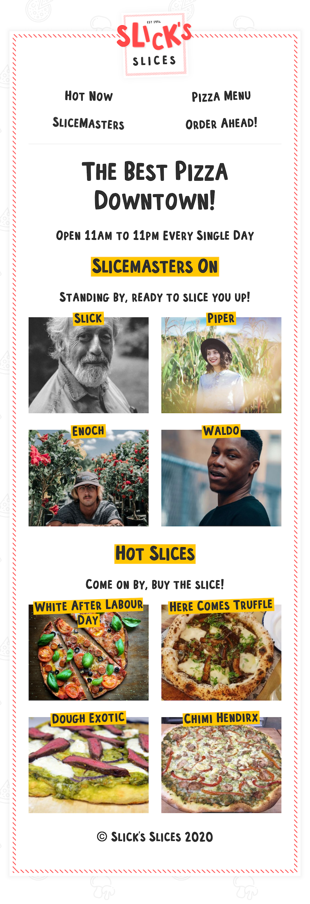

# Slick's Slices Frontend

This is a web application created for a fake pizza shop called Slick's Slices.

It is built with [Gatsby](https://www.gatsbyjs.com/) and uses [Sanity](https://www.sanity.io/) for a headless CMS.

⚡️ **[View Live Demo](https://slicks-slices.netlify.app/)** ⚡️

## 📸 Screenshots

## ⚡️ Technologies

-   [Gatsby](https://www.gatsbyjs.com/)
-   [Sanity](https://www.sanity.io/)
-   [GraphQL](https://graphql.org/)
-   [Netlify](https://www.netlify.com/)
-   Serverless functions hosted on [Netlify](https://www.netlify.com/)
-   [Styled Components](https://styled-components.com/)
-   Fast, optimized images

## 🚀 Local Environment Setup

1. Copy `.env.EXAMPLE` to `.env`.
2. setup backend.
3. Get a new API token for your Sanity project and add it to the `SANITY_TOKEN` variable in `.env`.
4. Get the deployed GraphQL endpoint for your Sanity project and add it to the `GATSBY_GRAPHQL_ENDPOINT` variable in `.env`.
5. Add `MAIL_HOST`, `MAIL_USER` and `MAIL_PASS` values for a transactional email service in `.env` to send emails via the order form. 
6. Install dependencies with `yarn`.
7. Install serverless function dependencies with `yarn` in the `functions` directory.
8. Start your dev server with `yarn netlify`.

